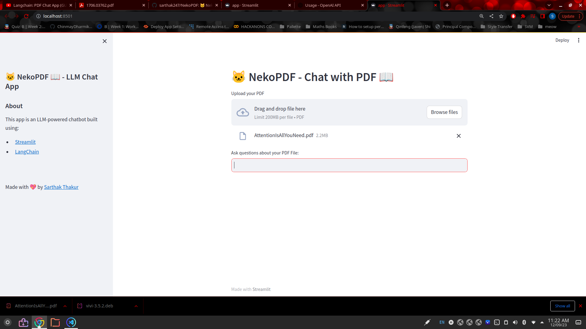
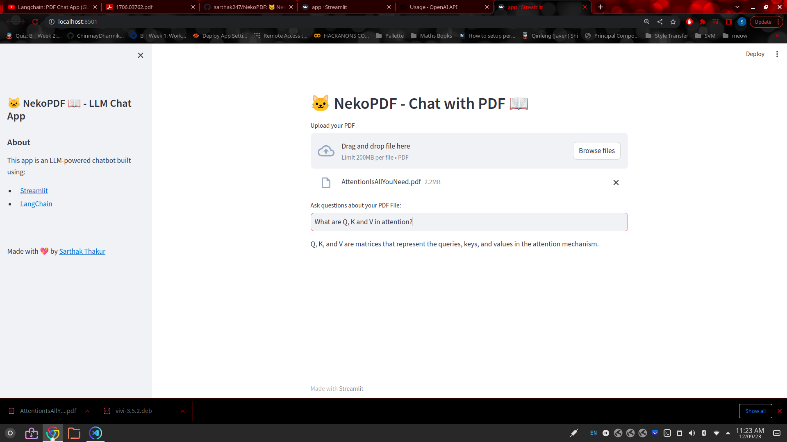
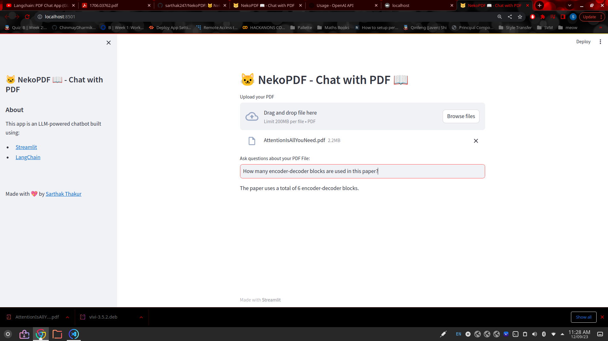

# 🐱 NekoPDF 📖 - Document Interaction with LLM
[](https://github.com/sarthak247/NekoPDF)

NekoPDF allows you to seamlessly interact with your documents using a Language Model (LLM) over the LangChain framework.

## Getting Started

To get started with NekoPDF, follow these simple steps:

1. Clone this repository:
   ```shell
   git clone https://github.com/sarthak247/NekoPDF.git
   ```

2. Install the required dependencies from the `requirements.txt` file using pip:
   ```shell
   pip install -r requirements.txt
   ```

3. Configure your OpenAI API key:
   - Open the `.env` file in the project directory.
   - Replace `'YOUR API KEY HERE'` with your actual OpenAI API key.

4. Upload a PDF document:
   - Use the web interface to upload the PDF document you wish to work with. In this example, we are using the "Attention Is All You Need" paper.

   

5. Query your PDF with questions:
   - Once the PDF has been uploaded and processed, you can interact with it by asking questions. Here are two examples:

   - Query 1 
   - Query 2 

## Supported Language Models (LLMs)

NekoPDF currently supports the following Language Models:

- [OpenAI API](https://openai.com)
  
Future updates will include support for the following LLMs:

- [HuggingFace API](https://huggingface.co)
- [Cohere AI](https://cohere.ai)
- [MosaicML](https://mosaicml.com)

Stay tuned for exciting enhancements and integrations!

---

**Note**: Make sure to respect API usage policies and guidelines when using external Language Model APIs. Refer to the respective documentation for more information.
```